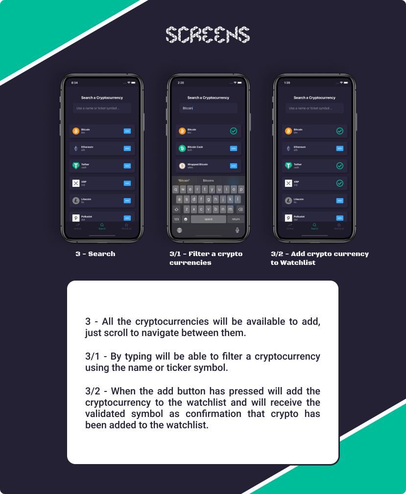

<h1 align="center">
    
</h1>

<p align="center">
  <a href="#-technology">Technologies</a>&nbsp;&nbsp;&nbsp;|&nbsp;&nbsp;&nbsp;
  <a href="#-project">Project</a>&nbsp;&nbsp;&nbsp;|&nbsp;&nbsp;&nbsp;
  <a href="#memo-license">License</a>
</p>

<p align="center">
 

  
</p>

<br>

<p align="center">
  
</p>

## 🚀 Technologies

This project was built with the technology below:

### Core :

- [React Native](https://facebook.github.io/react-native/)
- [TypeScript](https://www.typescriptlang.org/)

### Navigation:

- [react-navigation](https://reactnavigation.org/docs/getting-started)
- [react-navigation-material-bottom-tab](https://reactnavigation.org/docs/material-bottom-tab-navigator)

### State Management:

- [redux](https://github.com/reduxjs/redux)
- [react-redux](https://github.com/reduxjs/react-redux)

### Styling:

- [react-native-elements](https://github.com/styled-components/styled-components)

## 💻 Project

<br>

CryptoTracker is a simple application to track and display your cryptocurrencies. You will be able to follow the price in realtime of the market and create your own watch list. Track the prices of different cryptocurrencies including Bitcoin, Ethereum, Litecoin and others.

It's not requested any credentials, the data will be stored locally on the device.

Cryptocurrency data provided by https://www.coingecko.com/en/api .

### :information_source: How To Use

<br>

To clone and run this application, you'll need [Git](https://git-scm.com), [Node.js v10.16][nodejs] or higher + [Yarn v1.13][yarn] or higher installed on your computer and the [Crypto Tracker](https://github.com/Fernandosilvasc/crytck.git).

Before starting the app make sure if you already have the environment setup, if not you can follow this guide available in this link: [Setting up the development environment on React-Native](https://reactnative.dev/docs/environment-setup).

From your command line:

### Get Started:

<br>

```bash
# Clone this repository
$ git clone https://github.com/Fernandosilvasc/crytck

# Go into the repository
$ cd crytck

# Install dependencies
$ yarn install

# Running the App on android simulator
$ yarn run android

# Running the App on ios simulator
$ yarn run ios
```

### Screens:

<p align="center">
  
</p>

<p align="center">
  
</p>

<p align="center">
  
</p>


## :memo: License

<br>

This project is licensed under the MIT License - see the [LICENSE](LICENSE.md) file for more information.

👨🏻‍💻 - Made by Fernando Corrêa da Silva.
